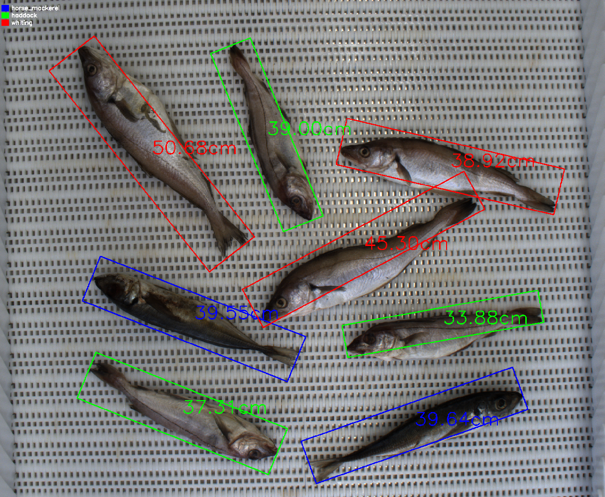

# PDI_tp
Trabajo práctico integrador de procesamiento digital de imágenes.

Sistema de segmentación, estimación de talla y clasificación de pescados.
## Dataset

El dataset **no está incluido en el repositorio**. Descargarlo desde:

> https://huggingface.co/datasets/vapaau/autofish/tree/main

Una vez descargado, colocar las imágenes en:

```
data/raw/
```

## Cómo ejecutar

Para el entrenamiento:
```bash
cd codigo
python main.py
```

Para las pruebas de una imagen:
```bash
cd pruebas
python test_unitario.py
```

Ejemplo:


